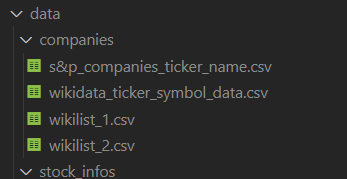

# Backtesting_Dividenden_Portfolio
## Description

This repository downloads financial data and prepares them for backtesting usage.

At the moment I have two notebooks to download data one for financialmodelingprep and one by alphavantage.

The alphavantage notebook is not used anymore.

## Structure

There are two important things which are not included directly in the online repository

A `data` folder where all the data is stored. 
The data folder has a structure like this:



---
to get the company data you need two sources one is the rdf query which is here:

https://query.wikidata.org/#%23%20query%20for%20wikidata%20which%20gets%20all%20S%26P%20500%20Companies%20and%20there%20symbol.%0ASELECT%20DISTINCT%20%3Fitem%20%3FitemLabel%20%3FawardLabel%20%3FawardStat%20%3FtickerSymbol%0A%7B%0A%20%20%20%20%3Fitem%20wdt%3AP361%2a%20wd%3AQ242345%3B%20%20%20%20%20%20%20%20%20%20%20%20%20%23%20Items%20with%20the%20Occupation%28P106%29%20of%20Director%28Q3455803%29%20or%20a%20subclass%28P279%29%0A%20%20%20%20%20%20%20%20%20%20p%3AP414%20%3FawardStat%20.%20%20%20%20%20%20%20%20%20%20%20%20%20%20%23%20...%20with%20an%20awarded%28P166%29%20statement%0A%20%20%20%20%3FawardStat%20pq%3AP249%20%3FtickerSymbol.%0A%20%20%20%20%20%20%20%20%20%20%20%0A%20%20%20%20SERVICE%20wikibase%3Alabel%20%7B%20%20%20%20%20%20%20%20%20%20%20%20%20%20%20%23%20...%20include%20the%20labels%0A%20%20%20%20%20%20%20%20bd%3AserviceParam%20wikibase%3Alanguage%20%22%5BAUTO_LANGUAGE%5D%2Cen%22%0A%20%20%20%20%7D%0A%7D 
- (column names are NOT correct at the moment)
- data is saved in the file `wikidata_ticker_symbol_data.csv`

the other data is directly scraped from a wikisite and has two lists:
https://en.wikipedia.org/wiki/List_of_S%26P_500_companies#Selected_changes_to_the_list_of_S&P_500_components

- first list is saved in `wikilist_1.csv`
- second list is saved in `wikilist_2.csv`


### stock_infos folder is the destination folder and the informations are generated while using the notebook


A `secret_file.json` where the api keys are saved.

the secrect_file.json looks like this 

```json
{"secret_key":"API_KEY",
"secret_key_fmp":"API_KEY"}
```


# Getting Started

1. Create secret_file.json with your secret key
2. Add folder structure as you need 
3. Add `companies` and `stock_info` folder
4. Add `s&p_companies_ticker_name.csv` inside the folder companies
5. Open finacialmodelingprep_api_access.ipynb and follow the instructions inside

This should do the trick.


- if you have no `s&p_companies_ticker_name.csv` list you need to add all wikilist's csv into your companies folder